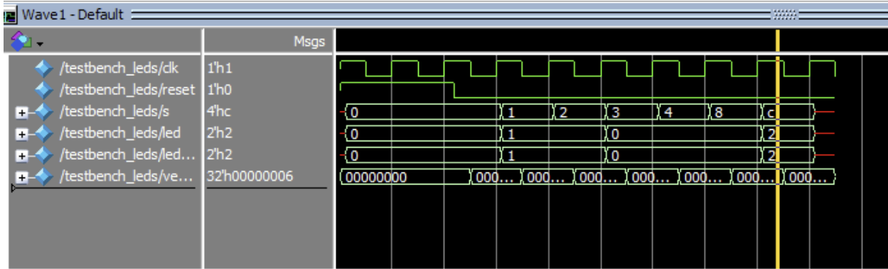
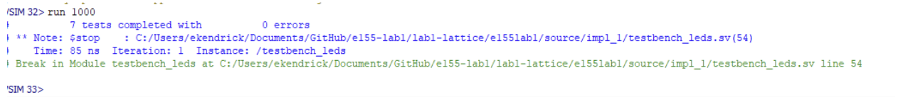
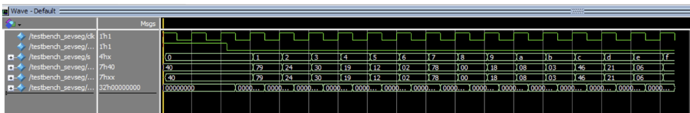
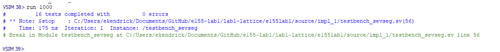
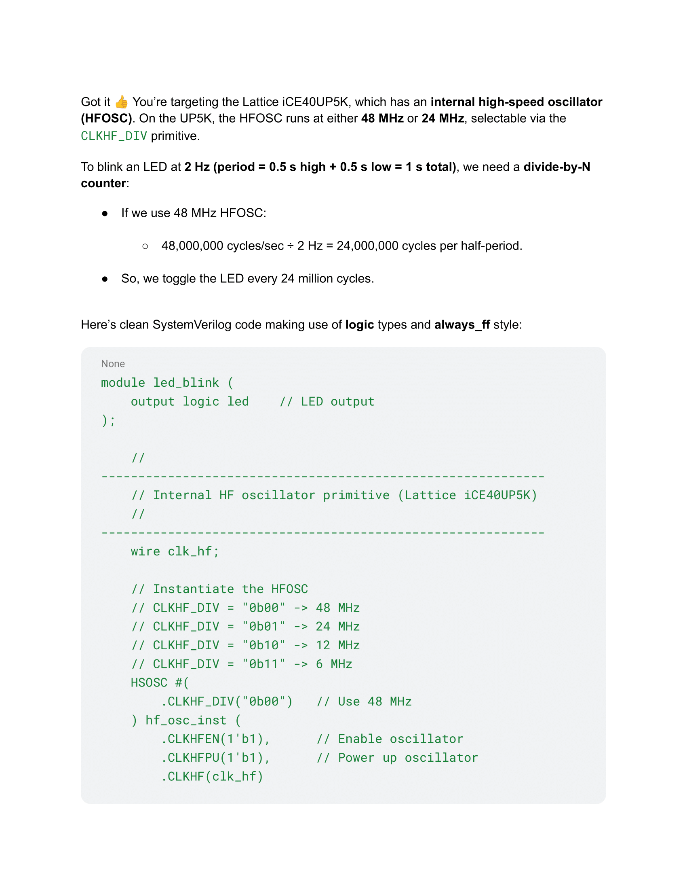
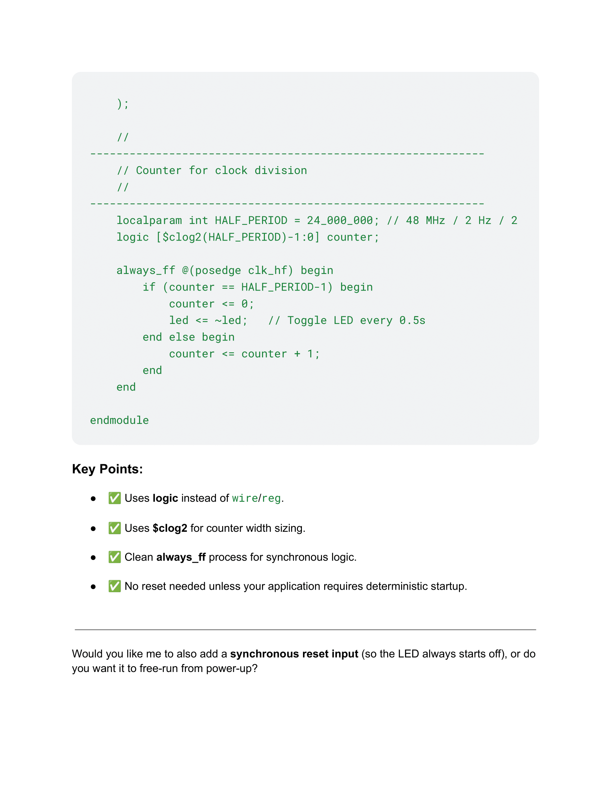

## Introduction

In this lab, a design was implemented on the FPGA to display a number 0-F (hex) on a seven-segment display using a 4-input DIP switch. The FPGA was also used to control three individual LEDs: two with combinational logic and the DIP switches, and the other blinked using the build-in high speed oscillator (which is 48 MHz) and a counter to achieve a blinking frequency of 2.4 Hz. 

## Design and Testing Methodology

The seven-segment display consists of diodes corresponding to each of the seven segmenets. It was controlled using combinational logic and the 4 DIP switches. Each possible combination of switches lights up a different combination of segments, which corresponds to a distinct digit. 

The ouptut of LED0 corresponds to S0 XOR S1, where S0 and S1 are the first two DIP switches. The output of LED1 corresponds to S2 AND S3, where S2 and S3 are the second two DIP switches. 

The on-board high-speed oscillator (HSOSC) form the iCE40 UltraPlus primitive library was used to generate a clock signal at 48 MHz. A counter was used to reduce this frequency to 2.4 Hz by either generating a signal to turn the LED on or off every 10,000,000 clock cycles. 

The design was developed using four modules: a top module, a module to control the blinking LED, a module to control the combinational logic LEDs, and a module for the seven-segment display logic. 

## Technical Documentation

The source code for the project can be found in the associated <a href="url">Github repository</a>.

### Block Diagram

### Schematic

## Results and Discussion

Physically, the design performed well. It performed all of the required tasks, including displaying an output on a seven-segment display and controlling three external LEDs. 

I had trouble testing the blinking LED, but was able to successfully test the seven segment display and the combinational logic LEDs. 
### Testbench Simulation

Figure 4: (top) Output waveform using an automated testbench for the two LEDs controlled with combinational logic. (bottom) Simulation output. 

Figure 5: (top) Output waveform using an automated testbench for the combinational logic associated with the seven-segmenet display. (bottom) Simulation output.

## Conclusion

A development board was assembled to control an UPduino 3.1 FPGA. The digital design using this FPGA successfully a) output a distinct digit on a seven-segment display based on an input from 4xDIP switch, b) used combinational logic and inputs from 4xDIP switch to control two LEDs, and c) blinked an external LED using the on-board high-speed oscillator. Everything was successfully tested except for the blinking LED. I spent a total of 15 hours on this lab. 

## AI Prototype Summary

I asked ChatGPT to create a SystemVerilog HDL module to use the HSOSC in the FPGA and blink an LED at 2Hz, taking full advantage of SystemVerilog syntax. Right off the bat,  I noticed it used "wire" even after I told it not to use wire. It did successfully recognize the clock frequency of the FPGA. The design synthesized on the first try, so there were no errors. The solution it gave me was very similar to how I implemented the blinking LED. The ChatGPT output is given below. 

