## Introduction

In this lab, a design was implemented on the FPGA to display two numbers 0-F (hex) on a dual seven-segment display using two 4-input DIP switch. One seven-segment SystemVerilog module and 7 FPGA pins was used to drive both halves of the display by implementing time multiplexing. Five singular LEDs also displayed the sum of the two digits displayed on the seven-segment displays in binary. 

## Design and Testing Methodology 

The seven-segment display consists of diodes corresponding to each of the seven segmenets. It was controlled using combinational logic and 4 DIP switches. Each possible combination of switches lights up a different combination of segments, which corresponds to a distinct digit. Since only one seven-segment display can be controlled at a time by a single SystemVerilog module and 7 FPGA pins, the two digits were blinked on and off at a frequency of 4800 Hz, a frequency too high for the human eye to detect. 

The on-board high-speed oscillator from the iCE40 UltraPlus primitive library was used to generate a clock signal at 48 MHz. A counter was used to reduce this frequency to 4800 Hz by inverting an output signal every 10,000 clock cycles. At each of the reduced clock cycles, a multiplexer is used to choose which of the seven-segment displays to turn on (by applying power to the common anode or not). 

A PNP transistor was used to drive each of the common anodes of the seven-segment display, since the FPGA GPIO pins are incapable of driving sufficient current to power all seven segments. 

The output of LED[5:0] corresponds to the sum of the two digits displayed on the seven-segment displays.

The design was developed using four modules: a top module, a for the clock counter, a module for the seven-segment display logic, and a module for the 2:1 multiplexer. 

## Technical Documentation

The source code for the project can be found in the associated <a href="https://github.com/emenemi1y/e155-lab2">Github repository</a>

### Calculations

According to the iCE40 UltraPlus Family Data Sheet section 4.17, the maximum output current for a single FPGA I/O pin (IOL / IOH) is 8 mA. Using a 150 Ω resistor, and with a diode forward voltage of 2.0V, the amount of current draw for a single segment is 8.67 mA, already exceeding the maximum allowable current draw for a pin. Seven segments will require 60.7 mA of current. 

To account for this, a PNP transistor can be used to provide enough current for the entire display. The base of the transistor is connected to the FPGA pin in series with a 2.2 kΩ resistor, which limits the current through the pin to 1.1 mA. The emitter is connected to power, and the base is connected in series with the LED segent, a 150 Ω resistor, and an FPGA output pin. The PNP transistor has a DC current gain of 80 for the magnitudes of currents desired, which is plenty large enough for what is required. 

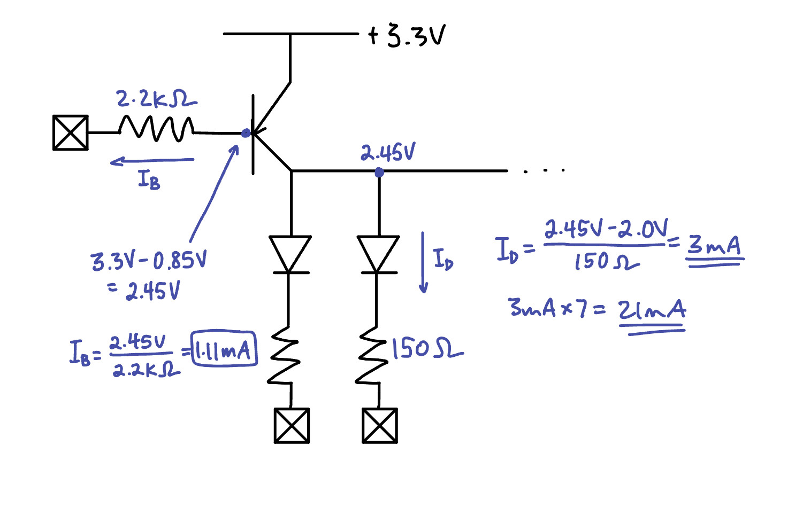
Figure 1: Calculation for current draw through each of the seven segments and the current draw through the FPGA pin when using the transistor. 

### Block Diagram

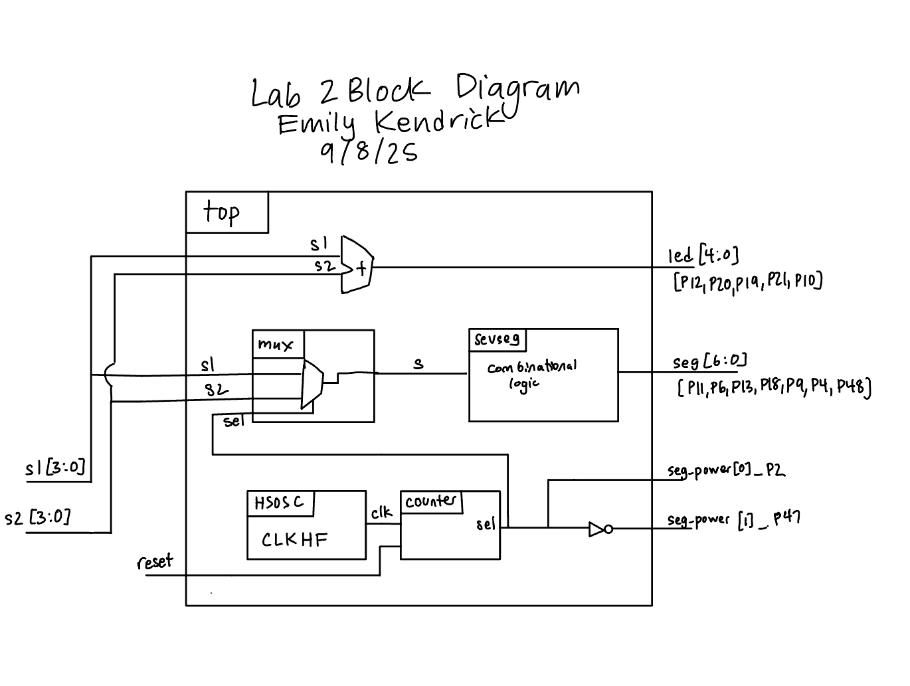
Figure 2: Block diagram

### Schematic

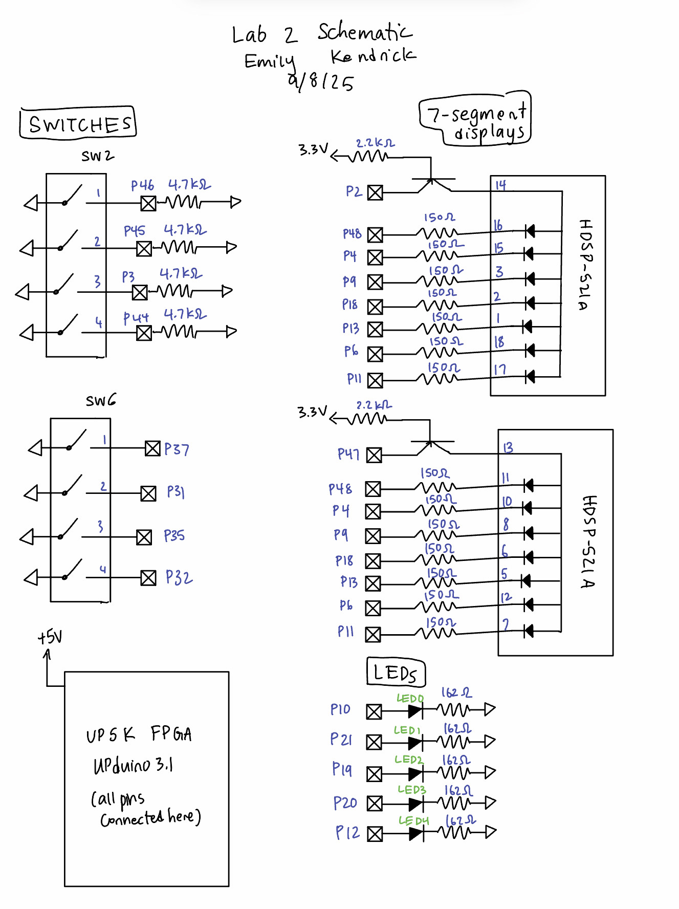
Figure 3: Electrical schematic

## Results and Discussion

The design performed as expected. It displayed the two digits without any blinking or bleeding visible to the human eye, and controlled five external LEDs. 

### Testbench Simulation

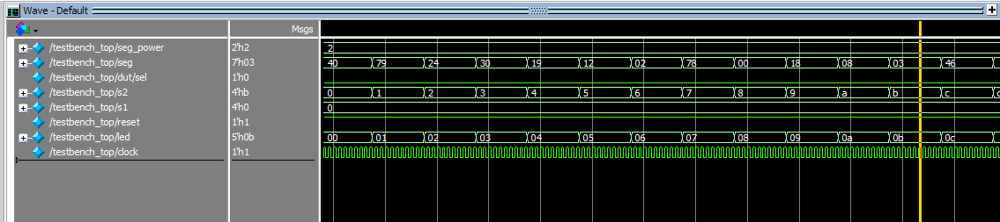
 Figure 4: A screenshot of the testbench simulation demonstrating successful running of the top module. 

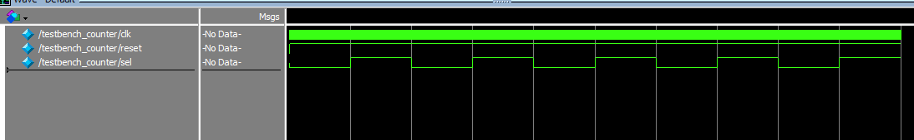
 
Figure 5: A screenshot of a testbench simluation demonstrating the counter module. The period of the clock was increased from 20 ns to 20000 ns, as expected. 

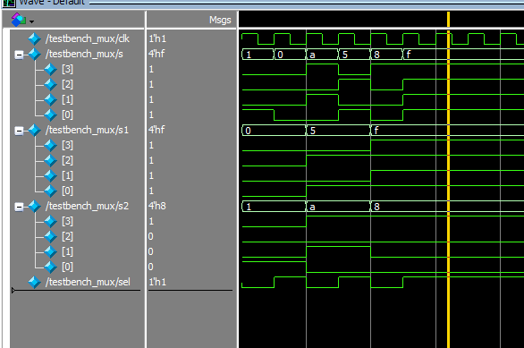
 \Figure 6: A screenshot of a testbench simulation demonstrating the mux module. 

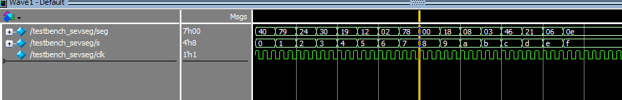
 Figure 7: A screenshot of a testbench simulation demonstrating the sevseg module. 

The design met all intended objectives. 

## Conclusion

The design successfully implemented time-multiplexing to blink two seven-segment LEDs using only seven output FPGA pins and a single sevseg module. The LEDs were blinked at a frequency of 4800 Hz. Five other LEDs displayed the sum of the two values displayed on the seven segment displays. 

## AI Prototype Summary

I asked ChatGPT to create a SystemVerilog HDL module to time multiplex a single seven segment decoder to decode two sets of input bits and drive two sets of seven output bits. It created a reasonable script to perform this task, which synthesized on the first try. One thing I noticed is that ChatGPT does not separate functions into seperate modules, and instead leaves everything in a top module, which can make it harder to understand. 

I then asked it to do it again using my files from Lab 1. I don't think it parsed my files well, because it couldn't extract the actual name of the module or the clock that I used. The output is shown below: 

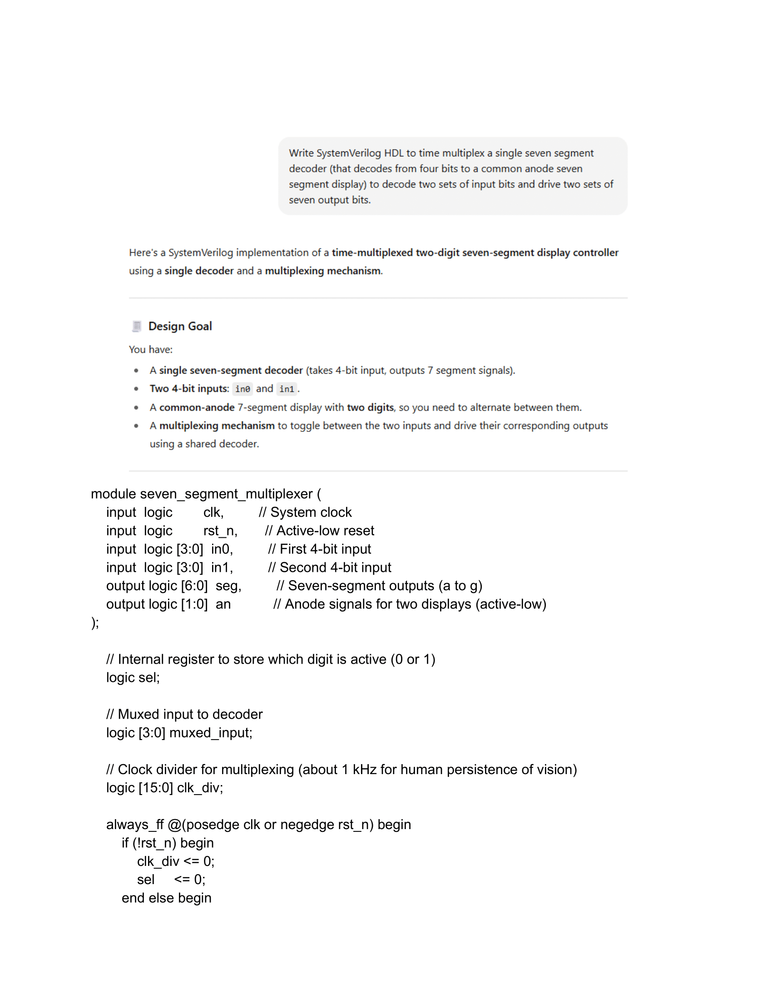
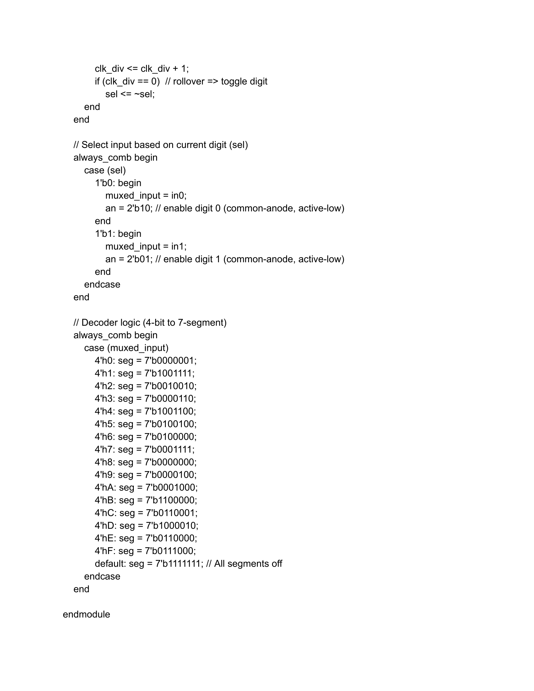
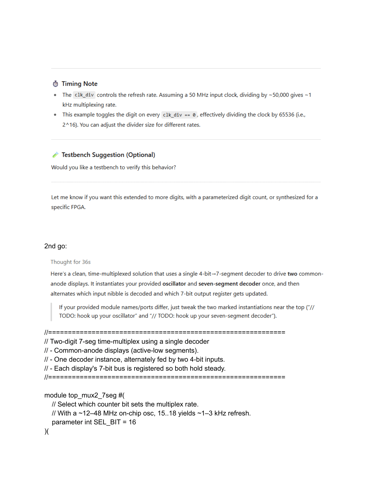
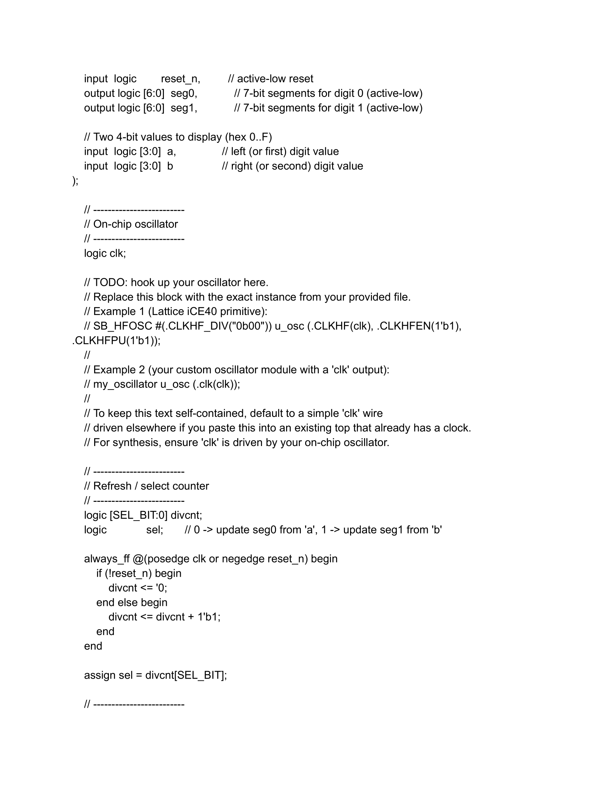
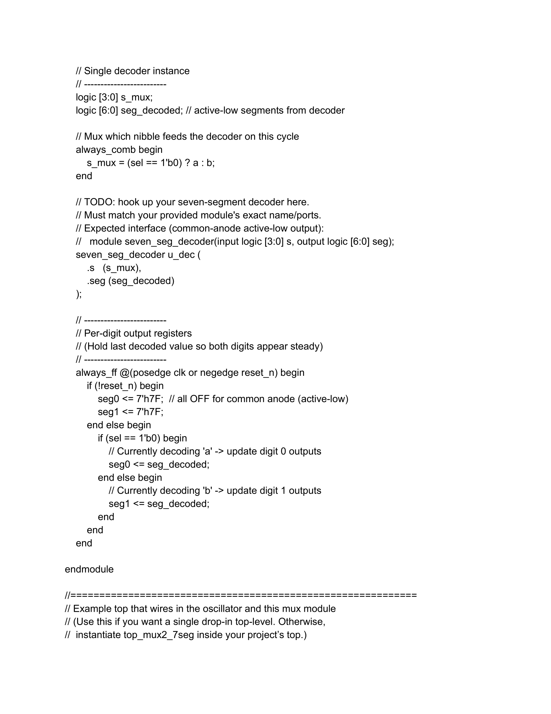
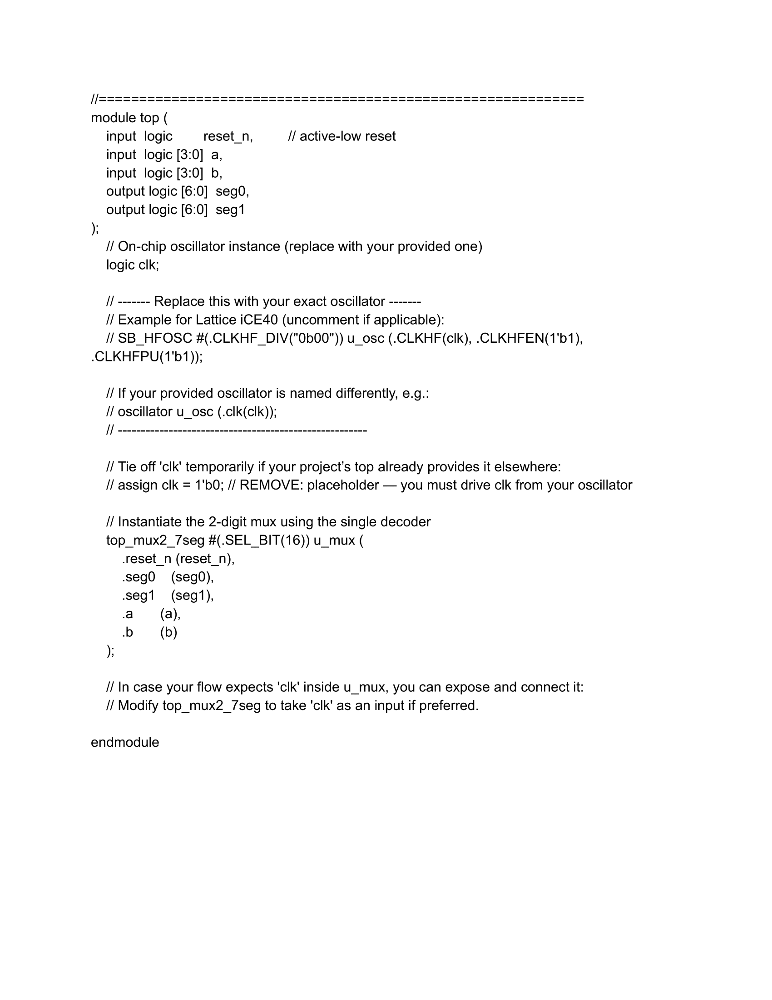

