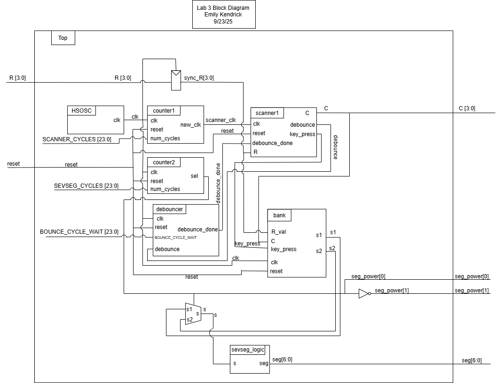
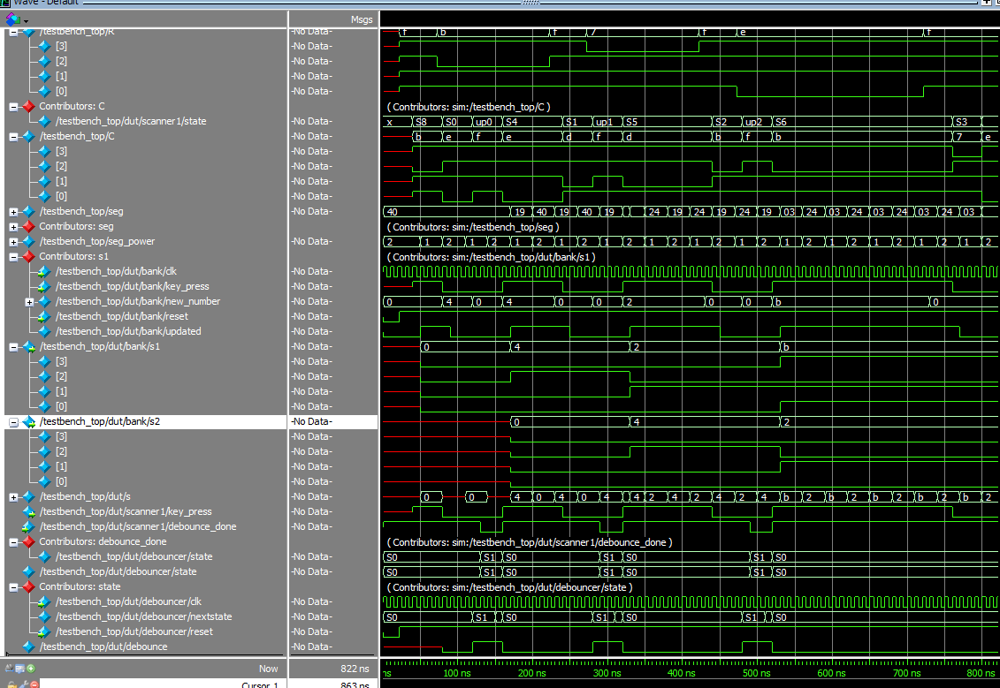

## Introduction

In this lab, a design was implemented on the FPGA to display two numbers 0-F (hex) on a dual seven-segment display read from a 4x4 keypad input. One seven-segment SystemVerilog module and 7 FPGA pins was used to drive both halves of the display using time multiplexing. The seven-segment display shows the last two hexadecimal digits pressed. Inputs from the keypad were read by scanning through each of the possible combinations of rows and columns.

## Design and Testing Methodology

Seven segment display: 

The seven-segment display consists of diodes corresponding to each of the seven segmenets. It was controlled using combinational logic and 4 DIP switches. Each possible combination of switches lights up a different combination of segments, which corresponds to a distinct digit. Since only one seven-segment display can be controlled at a time by a single SystemVerilog module and 7 FPGA pins, the two digits were blinked on and off at a frequency of 4800 Hz, a frequency too high for the human eye to detect. 

The on-board high-speed oscillator from the iCE40 UltraPlus primitive library was used to generate a clock signal at 48 MHz. A counter was used to reduce this frequency to 4800 Hz by inverting an output signal every 10,000 clock cycles. At each of the reduced clock cycles, a multiplexer is used to choose which of the seven-segment displays to turn on (by applying power to the common anode or not). 

A PNP transistor was used to drive each of the common anodes of the seven-segment display, since the FPGA GPIO pins are incapable of driving sufficient current to power all seven segments. 

Keypad: 

Power was applied to each column of the keypad one at a time using an output from the FPGA at a frequency of x Hz. For each column, all inputs from each row were read. If a keypress was detected, a new input was displayed on the seven-segment display. While one key is pressed, no other inputs are read. Once a key is unpressed, the scanner module FSM resumes scanning.

The entire design was developed using five modules. This included "scanner" for the scanner FSM, "debounce" for the debounce FSM (which accounts for switch debouncing when a key is pressed), "numberbank" which stores the numbers being pressed, "sevseg" which contains the combinational logic to light up the LEDs on the seven-segment display, and a top module. 

## Technical Documentation

The source code for this lab can be found in the associated <a href="https://github.com/emenemi1y/e155-lab3">Github repository</a>

### Block Diagram

  Figure 1: Block diagram

### Schematic

## Results and Discussion

The design did not work as expected. There is likely a timing issue that is causing it to be stuck in state 8 (which was not apparent through simulation), and is not registering the button presses. 

### Testbench Simulation

  Figure 2: Simulation waveforms for the top module.

## Conclusion

The design did not work. I spent 25 hours on this lab.

## AI Prototype Summary