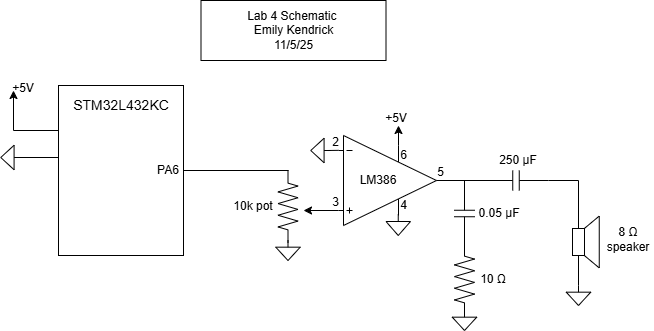
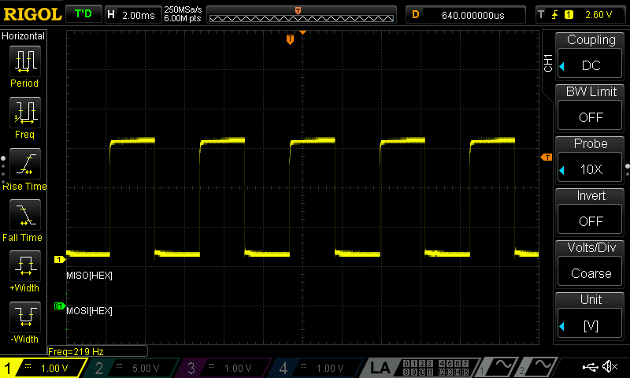
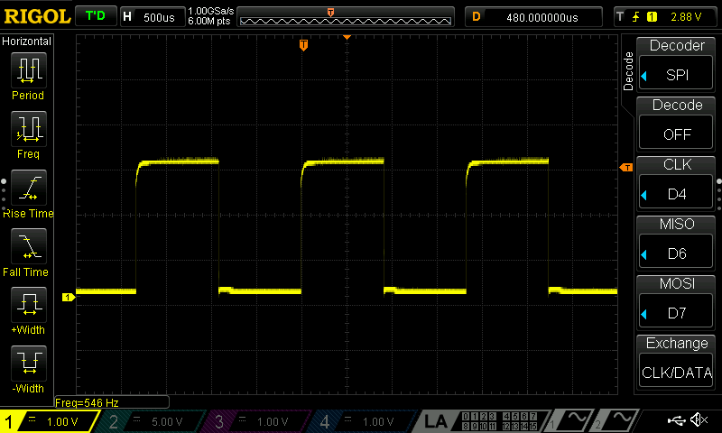
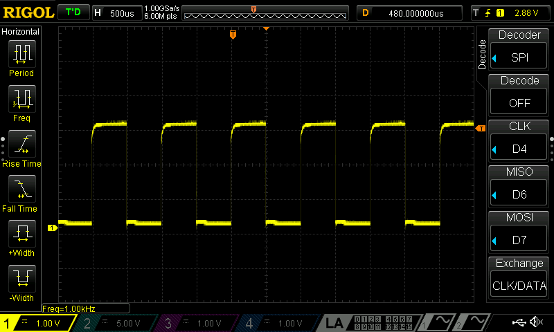
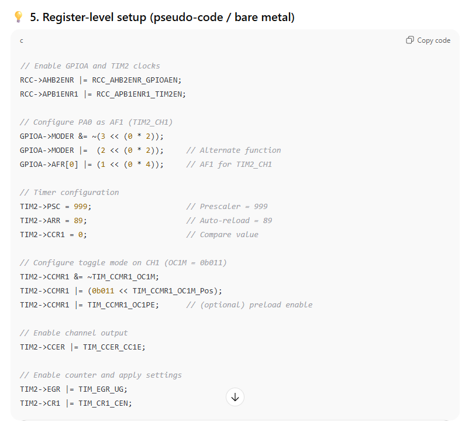

## Introduction

In this lab, a design was implemented on the MCU to play a song on a speaker using the timers in the MCU. The song was read as a series of notes and durations. The notes were converted to PWM pulses to be output on the MCU to the speaker. An audio amplifier was used to both reduce the volume of the speaker and to prevent significant current being drawn from the MCU pins. 

## Design and Testing Methodology

The MCU takes a series of notes and durations and outputs PWM waveforms correponding to them. PWM mode was configured on the MCU for TIM16 so that the correct waveform could be output from a pin. Another general purpose timer (TIM15) was used to generate delays between each of the notes. 

The pitches were accurate within 1% accross the frequency range of 220-1000 Hz. The TIM16 clock was set to 1 MHz, and the values of ARR and CCR1 were set to achieve the right frequency. For 220 Hz, ARR was set to (int) (1000000/220) - 1 = 4544, and CCR1 was set to 4545 / 2 - 1= 2272. If each original clock unit takes 1/1000000 s = 1μs, then 4545 counts willtake 4.545 ms. The frequency corresponding to a period of 4.545 ms is 220.02 Hz, which is within 1% of the desired 220 Hz. For 1000 Hz, ARR was set to (int) (1000000/1000) - 1 = 999, and CCR1 was set to (int) (1000/2) - 1 = 499 to achieve a 50% duty cycle. Again, if each original clock unit takes 1μs, then the period of the PWM signal is 1 ms, which corresponds to a frequency of 1000 Hz (again within the desired 1% range). 

<b> Minimum duration supported </b>
The durations are determined by the delays of TIM15, which depends on the value that is stored in ARR. Since the base time unit for TIM15 is 1 ms, an ARR value of 1 corresponds to a delay of 1 ms. The shortest delay possible would correspond to a single clock cycle of TIM15, which is 1ms. 

<b> Maximum duration supported </b>
The ARR register for TIM15 is 16 bits. Therefore, the maximum duration supported corresponds to ARR = FFFFFFFF, or 65,535, and is 65535 seconds, or 18 hours, 12 minutes, and 15 seconds. 

<b> Minimum frequency supported </b>
The frequency is determined by the values in the ARR and CCR1 registers of TIM16. Because the clock of TIM16 is set to 1 MHz, ARR is calculated by dividing 100000 by the frequency (as an integer). The maximum value that can be stored in ARR is 65535, and therefore the minimum frequency that can be supported is roughly 15.26 Hz (1000000/15.26) = 65531. The CCR1 value is set to half of this, and therefore will not be overloaded for any frequency that the ARR can handle. 

<b> Maximum frequency supported </b>
Since the values in the ARR and CCR1 registers must be integers, the maximum frequency supported would correspond to ARR = 2 and CCR1 = 1, which would be 1000000 Hz / 2 = 5 kHz. 

## Technical Documentation

The source code for the project can be found in the associated <a href="https://github.com/emenemi1y/e155-lab4-again">Github repository</a>

### Schematic 

  

Figure 1: Electrical schematic

## Results and Discussion

The design performed as expected. It played a song on a speaker using the PWM and upcounting modes in the STM32L432KC microcontroller timers. The signal was driven through an audio amplifier that allowed for adujustment of the volume of the speaker with a potentiometer. Output frequencies and delays were accurate within 1%. See Figures 2, 3, and 4 below for the output freuqencies for 220, 550, and 1000 Hz, respectively. 

  

Figure 2: 220 Hz output waveform

  

Figure 3: 550 Hz output waveform

  

Figure 4: 1000 Hz output waveform

## Conclusion

The design successfully implemented timers to control a speaker and play a song based on input frequencies and durations. It output the signal to an audio amplifier op-amp circuit, which allowed for volume adjustment using a potentiometer. I spent around 15 hours on this lab. 

## AI Prototype

I asked ChatGPT to answer the following question: "What timers should I use on the STM32L432KC to generate frequencies ranging from 220Hz to 1kHz? WHat's the best choice of timer if I want to easily connect it to a GPIO pin? What formulae are relevant, and what registers need to be set to configure them properly?"

It recommended that I use TIM2, TIM15, TIM16, or TIM17 because they all support Output Compare or PWM mode. It suggested that TIM2 would be the best because it is 32-bit, which makes it easier to hit low frequencies. The equations that it suggested were important were the ones that gave me the frequency of the timer, the frequency of the update, and the output frequency. These are the same formulas that I used when I was configuring PWM myself. It also gave me code to configure the registers, as can be seen in Figure 5 below. 

  
 
Figure 5: AI code output

The AI output did not configure the BDTR registers like I did, but other than that the code was very similar. ChatGPT did not need me to upload the reference manual to get the right registers. The code it gave me (after I asked it to change to TIM16, PA6, and my 20MHz clock) successfully generated a square wave, but was not the frequency it said it would be (claimed 435 Hz, actually 86 Hz). This lab would have been a lot faster using AI. 