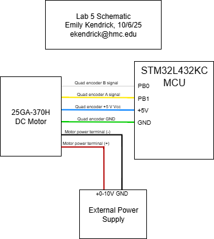
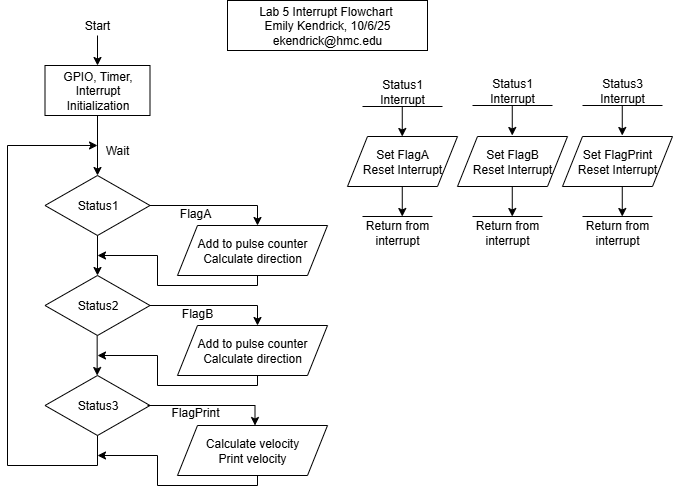
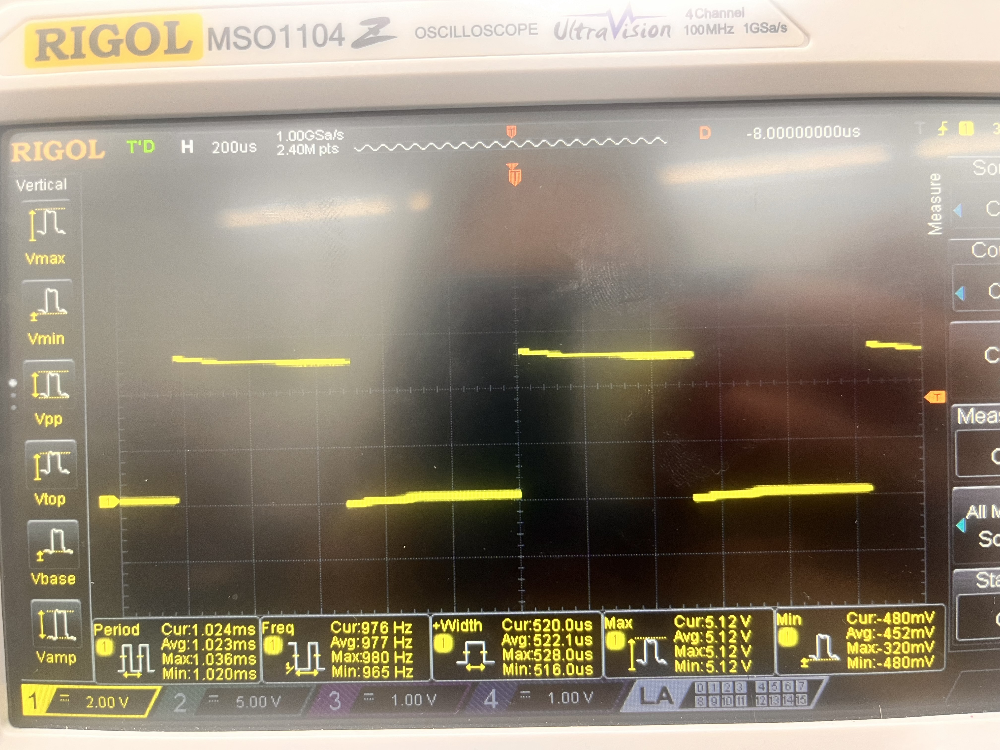
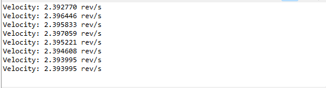

## Introduction
In this lab, a design was implemented on the MCU to use a quadrature motor encoder to calculate the velocity of a motor. The motor was connected to a power supply and powered with 0-10V DC to spin at a rate of up to 2-3 rev/s. 

## Design and Testing Methodology

The quadrature encoder can be used to measure the speed and direction of a motor. It consists of a patterned disk on the motor and two sensors that are 90 degrees out of phase with one another. By tracking the outputs of each of the two sensors, both velocity and direction can be determined. 

Interrupts and timers on the STM32L432KC microcontroller were used to calculate velocity. The quadrature encoder had two outputs: A and B, each of which correspond to a sensor output in the motor. Both the negative and positive edges of each of the motor encoder outputs were used to trigger interrupts. Therefore, 120*4 = 480 edges were detected per revolution. These interrupts enabled a flag that indicated a counter should be incremented; the counter and a timer were used to calculate an average velocity over the course of a second. The direction was calculated by measuring the phase of the A and B encoder outputs relative to each other. 

## Technical Documentation

The source code for the project can be found in the associated <a href="https://github.com/emenemi1y/e155-lab5">Github repository</a>

### Calculations

According to the motor specifications, the quadrature encoder has 408 pulses per rotation. Since I am using every positive and negative edge, that means there are 4 interrupts enabled for every pulse. Therefore, an interrupt should be triggered 408*4 = 1632 times each revolution. 

Revolutions per second are calculated by taking the average velocity over the course of a second. The number of edges detected is counted for a second, then divided by 1632. 

### Schematic

Figure 1: Electrical schematic

### Interrupt Flowchart

Figure 2: Interrupt Flowchart

## Results and Discussion

The design performed as expected. It displayed the average velocity at a rate of 1 Hz and with minimal error and recorded the direction of the motor.

### Accuracy

At 10.03V, my program was measuring that the velocity was around 2.393 rev/s (Figure 4). I also measured the output of the motor encoder using an oscilloscope (see Figure 3 below) and found that one pulse had a period of 1.023ms, corresponding to a velocity of 2.396 rev/s, indicating an error of 0.12%. 

Figure 3: Image of the output waveform of output A of the motor encoder. Note the average period of 1.023 ms.

Figure 4: Velocity output 

### Polling Comparison 

At 10.02V, the oscilloscope was measuring a period of 1.26 ms, corresponding to a velocity of 2.389 rev/s. My program using interrupts output a velocity of roughly 2.392 rev/s, which indicates an error of 0.13%. 

I reran a separate program that used polling to count the number of pulses instead of interrupts. This program gave me a velocity of around 2.406 rev/s. Because of motor drift, the velocity according to the oscilloscope was now 2.384 rev/s, indicating an error of 0.75%, much higher than the error using the interrupts. I still used an interrupt for the amount of time that the velocity was calculated and printed, so it makes sense that the measured velocity was higher than the actual velocity because of the latency of the GPIO pin read. Since it took time to read the GPIO pin, more GPIO pin outputs were measured after the interrupt was enabled and the interrupt flag was checked. 

## Conclusion

The design successfully implemented interrupts to calculate the velocity of a DC motor using a quadrature encoder. By detecting all of the positive and negative edges of both A and B outputs of the encoder, a high accuracy was able to be achieved. Direction was calculated using the phase difference of the two pulses from the A and B encoder outputs. I spent around 10-12 hours on this lab. 

## AI Prototype Summary

AI gave me the following code:

<pre><code> #include "stm32l432xx.h"

#define COUNTS_PER_REV   (408 * 4)      // quadrature x4 resolution
#define SAMPLE_PERIOD_MS 100

volatile int32_t last_count = 0;
volatile float encoder_speed_rps = 0.0f;

/* crude blocking delay assuming 4 MHz MSI clock */
static void delay_ms(uint32_t ms)
{
    for (volatile uint32_t i = 0; i < ms * 4000; i++);
}

void Encoder_Init(void)
{
    /* 1. Enable GPIOB and TIM2 clocks */
    RCC->AHB2ENR  |= RCC_AHB2ENR_GPIOBEN;
    RCC->APB1ENR1 |= RCC_APB1ENR1_TIM2EN;

    /* 2. Configure PB0/PB1 as AF1 (TIM2_CH3/TIM2_CH4) */
    GPIOB->MODER &= ~((3U << (0 * 2)) | (3U << (1 * 2)));   // clear mode bits
    GPIOB->MODER |=  ((2U << (0 * 2)) | (2U << (1 * 2)));   // AF mode
    GPIOB->AFR[0] &= ~((0xF << (0 * 4)) | (0xF << (1 * 4)));
    GPIOB->AFR[0] |=  ((1U << (0 * 4)) | (1U << (1 * 4)));  // AF1 = TIM2
    GPIOB->OSPEEDR |= (3U << (0 * 2)) | (3U << (1 * 2));    // high speed

    /* 3. Configure TIM2 in encoder mode using CH3 & CH4 */
    TIM2->CR1 = 0;                  // disable counter during setup
    TIM2->SMCR = 3;                 // SMS = 011 → encoder mode 3 (count on both inputs)
    TIM2->CCMR2 = (1U << 0) | (1U << 8);  // CC3S=01, CC4S=01 (map TI3 & TI4)
    TIM2->CCER = 0;                 // both channels non-inverted
    TIM2->ARR = 0xFFFFFFFF;         // 32-bit counter max
    TIM2->CNT = 0;                  // reset counter
    TIM2->CR1 |= TIM_CR1_CEN;       // enable counter
}

int32_t Encoder_GetCount(void)
{
    return (int32_t)TIM2->CNT;
}

float Encoder_GetSpeed(void)
{
    int32_t new_count = Encoder_GetCount();
    int32_t delta = new_count - last_count;
    last_count = new_count;

    encoder_speed_rps = ((float)delta / COUNTS_PER_REV) / (SAMPLE_PERIOD_MS / 1000.0f);
    return encoder_speed_rps;
}

int main(void)
{
    Encoder_Init();

    while (1) {
        delay_ms(SAMPLE_PERIOD_MS);
        float speed = Encoder_GetSpeed();  // revolutions per second
        // TODO: send via UART or use for control
    }
}
</code></pre>

AI was insistent on using Hardware Timer Encoder mode instead of the interrupts I told it to use. It took some fiddling with AI to get the code to fit with my system (using pins that were available on the breakout board, not using HAL since I didn't have it on my computer and didn't want to look for it, using a timer I wanted it to use), and then it didn't even end up working. I am not completely sure what was wrong with it in the end, since I don't understand Hardware Timer Encoder mode, but it did seem good at replacing pins I wanted it to replace and changing around the timers when I asked. 