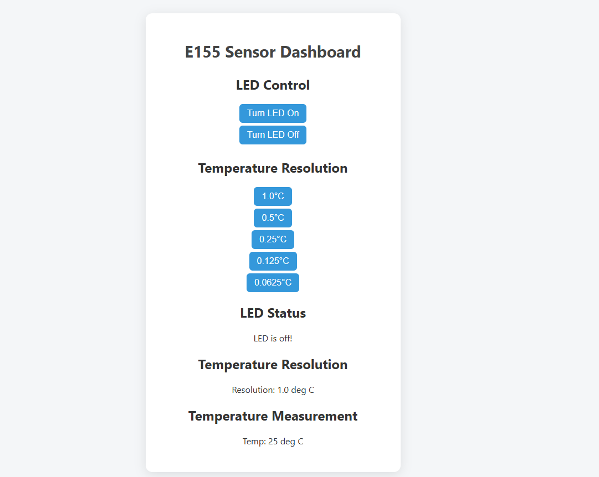

## Introduction

In this lab, a design was implemented on the MCU to read a temperature from a temperature sensor using SPI communication, and display this temperature on a webpage using a UART connection. Using the webpage, the resolution of the temperature sensor can be changed and a LED can be turned on and off.

## Design and Testing Methodology

The MCU communicates with the DS1722 digital temperature sensor over SPI. The clock of the SPI is set to 2.5 MHz by dividing the system clock of 80 MHz. Data is written to the temperature sensor to indicate which resolution the temperature should be read at. Then, temperature data is sent back from the sensor to the MCU, 8 bits at a time. The temperature is stored in two's complement floating-point format. 

The temperature read from the temperature sensor is converted back to Celsuis and displayed on a webpage, hosted on the ESP8266 WiFi development board. The MCU communicates with the ESP8266 via UART. Using the webpage, the user can set the temperature resolution and also control an output LED. 

## Technical Documentation

The source code for the project can be found in the associated <a href="https://github.com/emenemi1y/e155-lab6">Github repository</a>

### Schematic

  

Figure 1: Electrical schematic

### Logic Analyzer SPI transaction

  

Figure 2: Logic Analyzer SPI transaction

## Results and Discussion

The design performed as expected. It displayed a temperature in degrees Celsius at a selected resolution by communicating with a temperature sensor over SPI. The temperature sensor did jump from 24C to 27C occassionally, but this is likely due to imperfections in the temperature sensor. 

## Conclusion

The design successfully implemented SPI communication to communicate with a temperature sensor to get temperature measurements. It also communicated via UART with a WiFi module to host a webpage to display the temperature and the status of an LED. I spend around 20 hours on this lab, mostly due to stupid mistakes (such as not realizing that the ribbon cable for the oscilloscope had a few broken pins despite the fact that someone had told me that, and using a pin for CE that was also being used for UART). 

## AI Prototype

I asked AI to create an html page to display the temperature for me. I fed it my C code and let it change just the HTML webiste. The website it gave me looked much cleaner than mine, and indicated that AI is good at doing simple tasks like creating a website that are standard for many different systems. The website that it gave me is shown below in Figure 3. I then asked it to create a function for measuring temperature. I think I need to do a bit more digging through the code that it gave me (the pin numbers are likely just off), but, while it successfully compiled and downloaded, it only output a temperature reading of zero. 

  

Figure 3: AI Prototype Website

