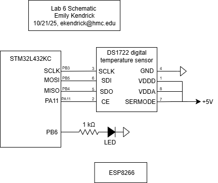

## Introduction

In this lab, a design was implemented on the MCU to read a temperature from a temperature sensor using SPI communication, and display this temperature on a webpage using a UART connection. Using the webpage, the resolution of the temperature sensor can be changed and a LED can be turned on and off.

## Design and Testing Methodology

The MCU communicates with the DS1722 digital temperature sensor over SPI. The clock of the SPI is set to 2.5 MHz by dividing the system clock of 80 MHz. Data is written to the temperature sensor to indicate which resolution the temperature should be read at. Then, temperature data is sent back from the sensor to the MCU, 8 bits at a time. The temperature is stored in two's complement floating-point format. 

The temperature read from the temperature sensor is converted back to Celsuis and displayed on a webpage, hosted on the ESP8266 WiFi development board. The MCU communicates with the ESP8266 via UART. Using the webpage, the user can set the temperature resolution and also control an output LED. 

## Technical Documentation

The source code for the project can be found in the associated <a href="https://github.com/emenemi1y/e155-lab6">Github repository</a>

### Schematic

  

Figure 1: Electrical schematic

### Logic Analyzer SPI transaction

## Results and Discussion

## AI Prototype
