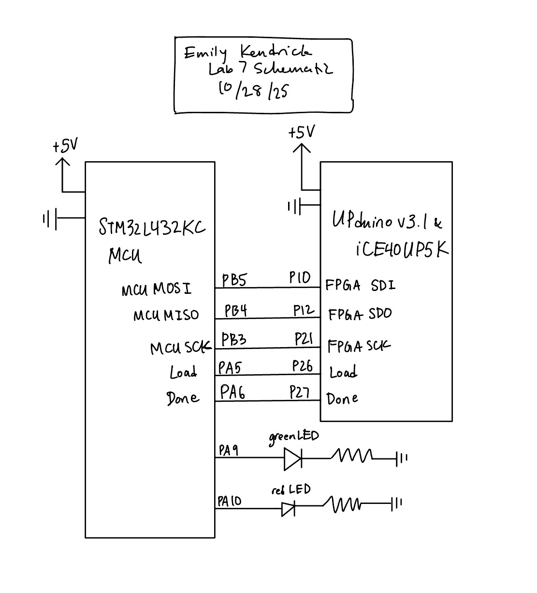
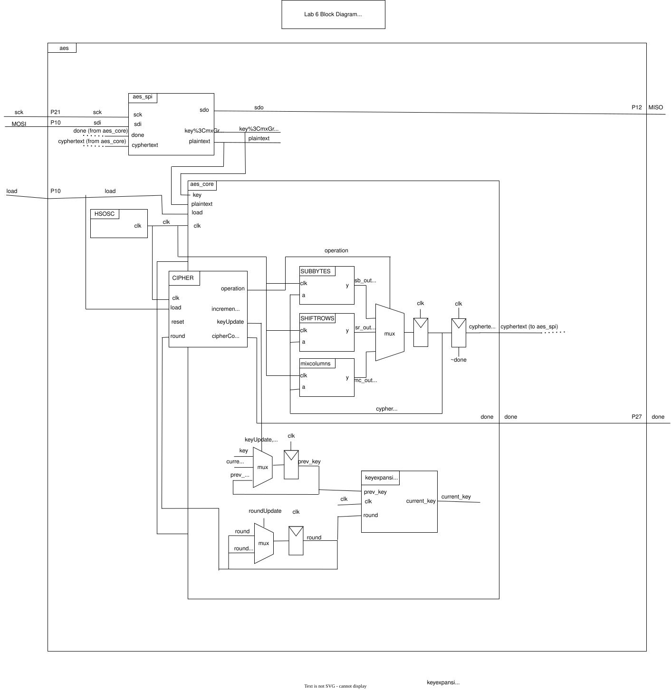
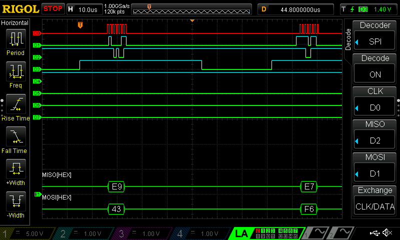
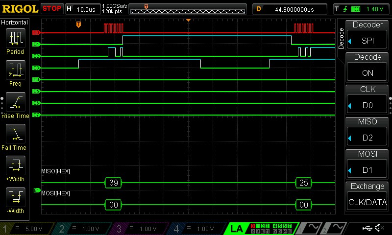
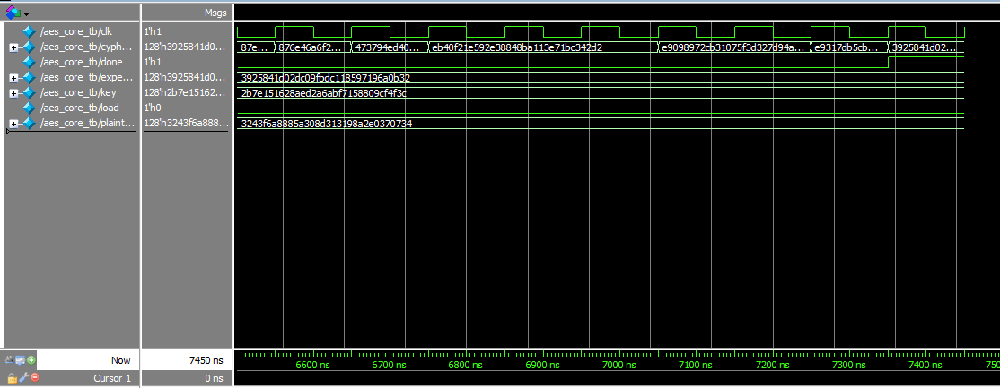
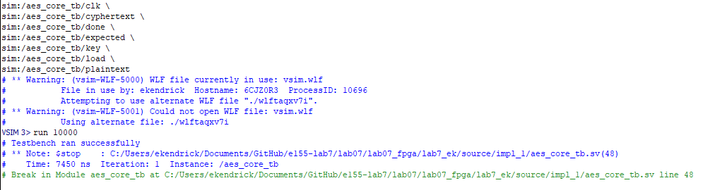
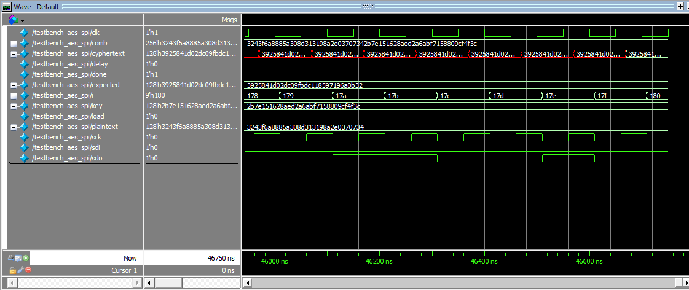
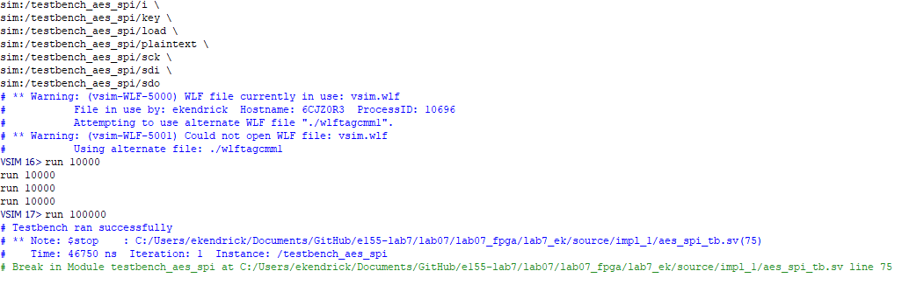
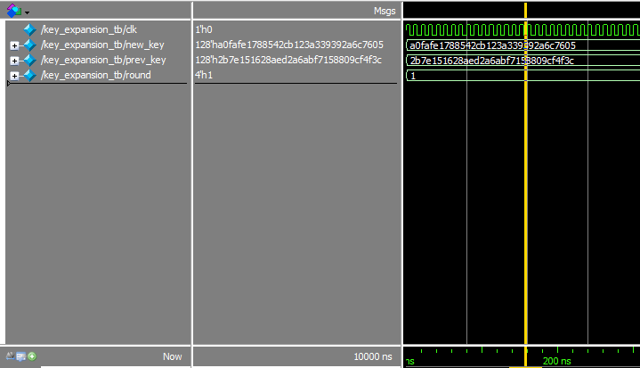
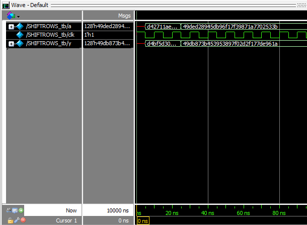

## Introduction

In this lab, a design was implemented on an FPGA to perform 128-bit AES encryption. The MCU was configured to send a 128-bit plaintext message to the FPGA, which then encrypted the message, and send the ciphertext back to the MCU over SPI.

## Design and Testing Methodology

The design was implemented using two FSMs (shown below in Figure 1) on the FPGA. The FSM cycled through each of the 10 rounds as specified in the NIST FIPS 197 document, which included four steps: AddRoundKey, MixColumns, SubBytes, and ShiftRows. A key is sent from the MCU to the FPA over SPI. The key is expanded one at a time using a KeyExpansion module, which is used during the AddRoundKey operation. Flip flops are used to keep track of the rounds and the current state of the cyphertext. A reset was controlled by a smaller FSM. 

  

Figure 1: Finite state machine for the cipher.

## Technical Documentation

The source code for the project can be found in the associated <a href="https://github.com/emenemi1y/e155-lab7">Github repository</a>

### Block Diagram

  

Figure 2: Block diagram

### Schematic

  

Figure 3: Schematic

### Logic Analyzer SPI Transaction

  

Figure 4: Oscilloscope logic analyzer SPI transaction for the second and third words of plaintext (MOSI from the MCU).

  

Figure 5: Oscilloscope logic analyzer SPI transaction for the first word of ciphertext (SDO from the FPGA).

## Results and Discussion

The design performed as expected. It received plaintext over SPI from the MCU to the FPGA, and successfully converted the plaintext to ciphertext. 

### Testbench simulations

  

Figure 6: Testbench waveforms for aes_core. 

  

Figure 7: Output of testbench for aes_core. 

  

Figure 8: Testbench waveforms for aes_spi. 

  

Figure 9: Output of testbench for aes_spi. 

  

Figure 10: Testbench waveforms for keyexpansion.

  
 
Figure 11: Testbench waveforms for shiftrows.

## Conclusion

The design successfully implemented SPI communication to facilitate communication between an FPGA and an MCU. The FPGA was programmed to convert a string of plaintext sent from the MCU into cyphertext (using the AES-128 bit standard)., and send that cyphertext back to the MCU. communicate with a temperature sensor to get temperature measurements. I spent around 12-15 hours on this lab.

## AI Prototype

The AI was fairly good at parsing the AES document and implementing the key expansion in SystemVerilog. I think that it's code was not as readable as it could be--the variable names were unnecessarily long. It changed the outputs and the inputs of my modules, but I assume that if I gave it my modules it would have been able to accurately create a working module. When I told it not to use the documentation, it created a method of using past outputs to create the current output. One thing I noticed was that it stored every single output instead of just the current one, which uses a lot of memory. If I were to actually use an LLM in my workflow, I would give it more of my existing code so it could build off of it.

 
